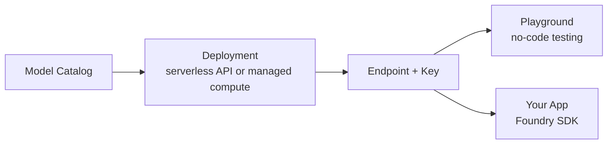
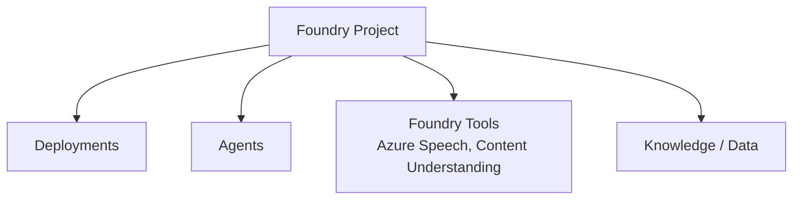
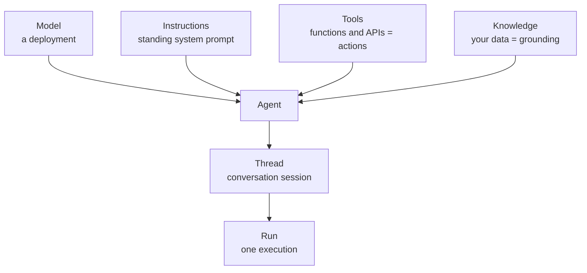
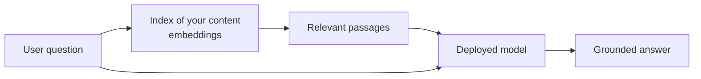

# Microsoft Foundry Architecture

This page gives a simple visual overview of how AI-901's main building blocks fit together.

Use these diagrams as memory anchors before practice tests. AI-901 rarely asks you to draw architecture, but it often asks which building block a scenario needs or where something fits in the pipeline.

## From catalog to application



Key idea: the catalog is for browsing; only a deployment is callable, and both the playground and your application call the same deployment.

Exam memory hook:

```text
Catalog    = browse and compare
Deployment = callable instance (your name for it)
Endpoint   = where to call
Key/Entra  = how to authenticate
```

## Inside a Foundry project



Key idea: the project is the workspace; deployments, agents, tools, and data all live inside it.

## Anatomy of an agent



Exam memory hook:

```text
Tools     = what the agent can DO
Knowledge = what the agent can READ
Thread    = the conversation
Run       = one execution on the thread
```

## Grounding / RAG flow



Key idea: the question first retrieves relevant passages from your indexed content; the model answers from those passages. That is why grounding fixes hallucinations and fine-tuning does not.
