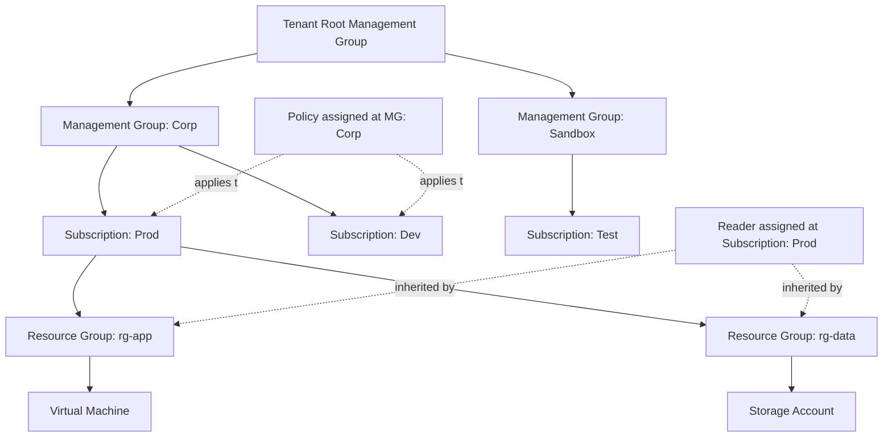
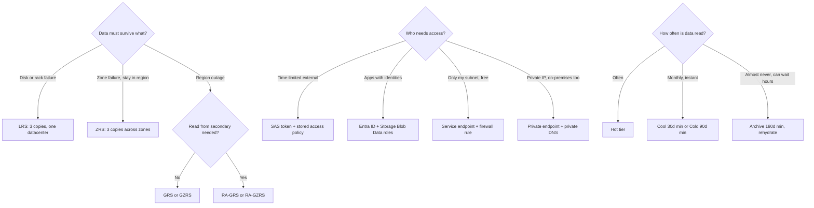
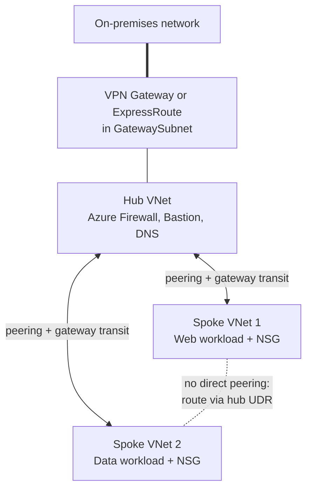
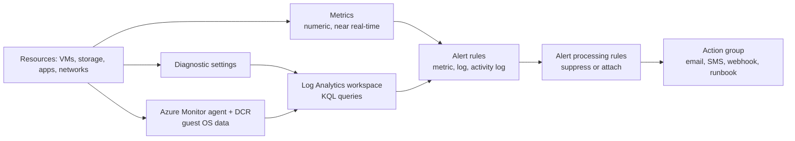
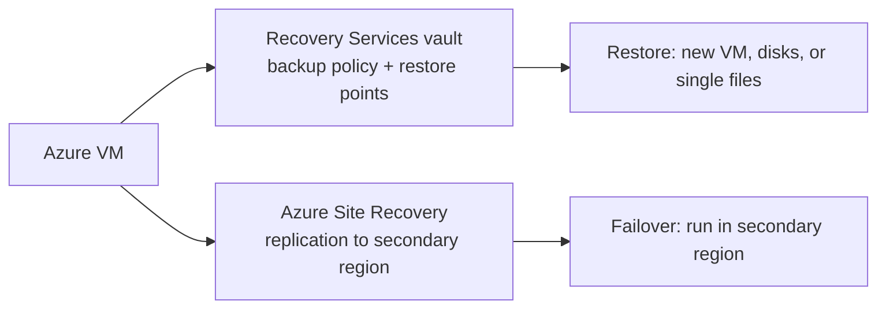

# AZ-104 Core Diagrams

This page gives visual anchors for the four structures AZ-104 tests most: governance inheritance, storage decisions, hub-spoke networking, and the monitoring pipeline.

Use these diagrams as memory anchors before practice tests. AZ-104 rarely asks you to draw architecture, but case studies assume you can see these structures in your head.

## Governance hierarchy with RBAC and Policy inheritance



Key idea: RBAC roles, Azure Policy, and locks assigned at a scope flow down to every child scope. Assign once at the management group to govern many subscriptions.

Exam memory hook:

```text
Root MG -> MG (up to 6 levels) -> Subscription -> Resource Group -> Resource
RBAC   = who can act        (inherited down)
Policy = what is allowed    (inherited down, Deny beats RBAC)
Lock   = keep it safe       (inherited down, ReadOnly beats CanNotDelete)
Tags   = organize and report (NOT inherited by default)
```

## Storage redundancy and access decision tree



Exam memory hook:

```text
Redundancy ladder: LRS < ZRS < GRS < RA-GRS < GZRS < RA-GZRS
RA-  = readable secondary
Tiers: hot -> cool(30) -> cold(90) -> archive(180, offline)
Lifecycle rules move blobs down the ladder automatically
```

## Hub-spoke network pattern



Key ideas:

- Peering is not transitive: spoke 1 cannot reach spoke 2 without a direct peering or a UDR sending traffic through the hub firewall.
- Gateway transit lets spokes use the hub's gateway ("allow gateway transit" on the hub, "use remote gateway" on spokes).
- Shared services (firewall, Bastion, DNS) live once in the hub.

Exam memory hook:

```text
Peering       = private backbone link, NOT transitive
Gateway transit = spokes borrow the hub's VPN/ExpressRoute
UDR 0.0.0.0/0 -> firewall = force all traffic through the hub
AzureBastionSubnet /26, GatewaySubnet = exact names required
```

## Monitoring and recovery data flow



Recovery paths are separate from monitoring:



Exam memory hook:

```text
Metrics = numbers now          Logs = KQL later
Alert rule fires -> action group notifies -> processing rule can silence
Backup  = restore data   (Recovery Services vault, same region as VM)
ASR     = keep running   (failover, RPO/RTO wording)
Backup vault (newer) = Disks, Blobs, PostgreSQL
```
