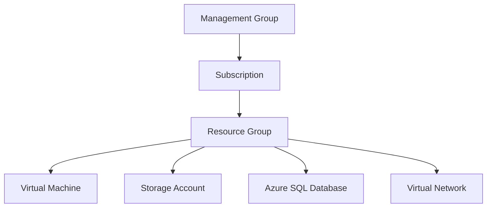
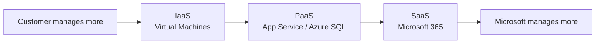
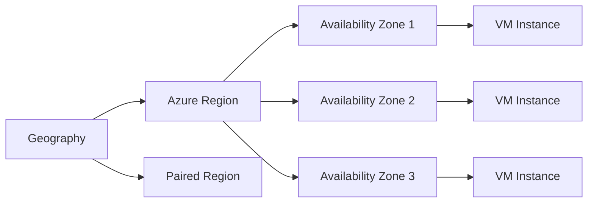
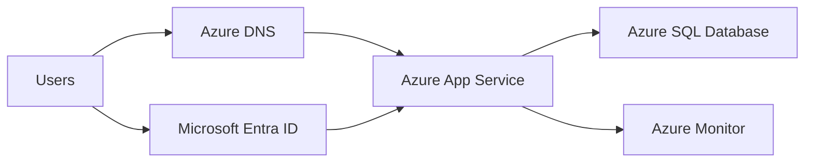
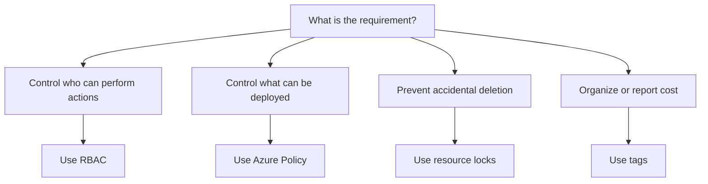
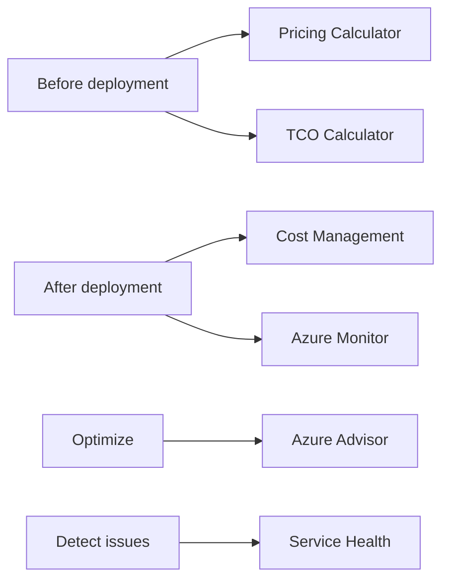

# Azure Core Architecture

This page gives a simple visual overview of Azure organization and core services.

Use these diagrams as memory anchors before practice tests. AZ-900 rarely asks you to draw architecture, but it often asks where a service fits in the Azure hierarchy or which service belongs in a simple solution.

## Azure management hierarchy



Key idea: governance and RBAC assigned higher in the hierarchy can be inherited by lower levels.

Exam memory hook:

```text
Management group = many subscriptions
Subscription     = billing/access boundary
Resource group  = lifecycle container
Resource        = actual Azure service
```

## Cloud service model responsibility



Exam memory hook: IaaS gives the most control, SaaS gives the least management responsibility.

## Region, zone, and resource placement



Use availability zones for protection from datacenter failure inside one region. Use paired regions when thinking about regional disaster recovery.

Do not mix these up:

| Term              | Best memory                                  |
| ----------------- | -------------------------------------------- |
| Region            | City/area where Azure services are hosted    |
| Availability Zone | Separate datacenter location inside a region |
| Region Pair       | Two regions used for recovery planning       |

## Basic web app pattern



For AZ-900, focus on what each part does:

- Azure DNS resolves names.
- App Service hosts the web app.
- Azure SQL Database stores relational data.
- Azure Monitor collects metrics and logs.
- Microsoft Entra ID provides identity and access.

## Governance decision flow



This is one of the most useful AZ-900 decision patterns. Policy, RBAC, locks, and tags appear similar to beginners, but they solve different problems.

## Cost and monitoring lifecycle



Memory hook:

- Pricing Calculator estimates planned Azure services.
- TCO Calculator compares on-premises cost with Azure.
- Cost Management tracks actual spend.
- Azure Monitor collects metrics, logs, and alerts.
- Azure Advisor gives recommendations.
- Service Health shows personalized service issues.

