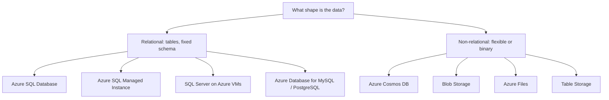
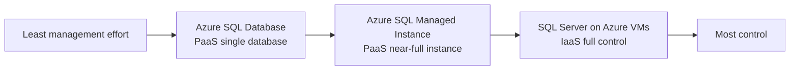
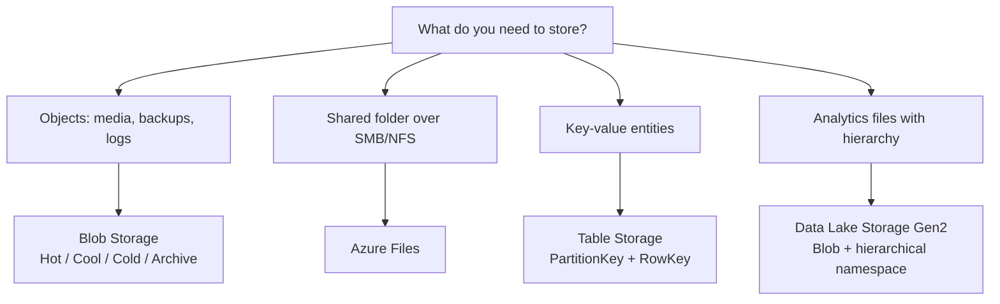
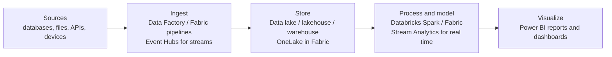
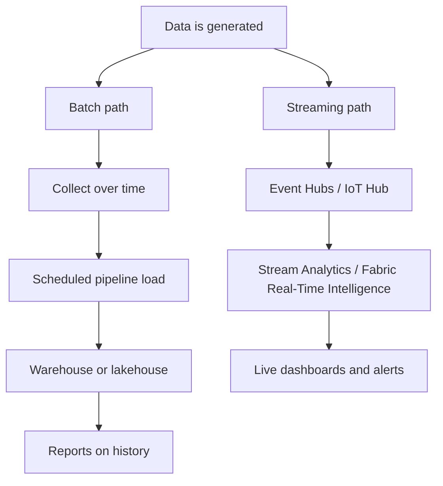

# DP-900 Data Landscape

This page gives a simple visual overview of the Azure data landscape.

Use these diagrams as memory anchors before practice tests. DP-900 rarely asks you to draw architecture, but it constantly asks which service fits a data shape or where a service sits in an analytics pipeline.

## Relational vs non-relational landscape



Exam memory hook:

```text
Fixed rows and columns  = relational family
JSON documents / global = Cosmos DB
Objects behind URLs     = Blob Storage
Mounted shares          = Azure Files
Cheap key-value rows    = Table Storage
```

## Azure SQL family control ladder



Exam memory hook: management effort and control move in opposite directions. New app means SQL Database; migration needing instance features means Managed Instance; OS access means the VM.

## Storage options by data shape



Exam memory hook:

```text
Hot     = frequent access
Cool    = infrequent, online
Cold    = rare, online
Archive = offline, rehydrate first
```

## Analytics pipeline



Exam memory hook: ingest, store, process, visualize. Pipelines move data, Databricks and Fabric process it at scale, Power BI shows it. If the scenario says "within seconds", swap the batch pieces for streaming ones (Event Hubs or IoT Hub in, Stream Analytics or Fabric Real-Time Intelligence to process).

## Batch vs streaming paths



Exam memory hook: batch waits and processes groups (latency in minutes or hours); streaming handles each event as it arrives (latency in seconds). Fraud alerts and live telemetry are streaming; nightly loads and monthly billing are batch.
