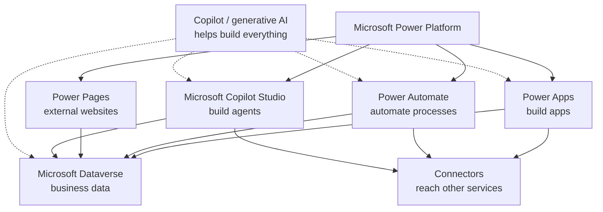
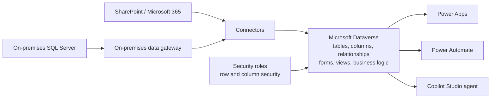
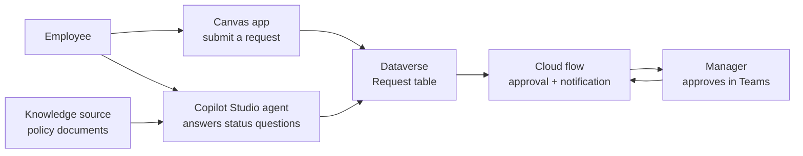
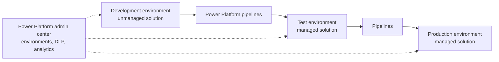

# Power Platform Map

This page gives a simple visual overview of the Power Platform family and how the pieces combine into solutions.

Use these diagrams as memory anchors before practice tests. PL-900 rarely asks you to draw architecture, but it often asks which component fits a scenario or how components work together.

## The Power Platform family



Exam memory hook:

```text
Power Apps      = apps for people
Power Automate  = flows for processes
Power Pages     = websites for external users
Copilot Studio  = agents for conversations and actions
Dataverse       = the shared data platform
Connectors      = bridges to everything else
Copilot         = AI that drafts all of the above
```

## Dataverse-centered data flow



Key idea: Dataverse sits in the middle. Connectors (plus the gateway for on-premises sources) bring data in and out, security roles guard the data, and apps, flows, and agents all work against the same tables.

Exam memory hook:

```text
Connector = the plug into a service
Gateway   = the extension cord into the on-premises network
Dataverse = data + security + logic + forms + views in one platform
```

## Solution pattern: app + flow + agent



This is the classic PL-900 combined scenario: an app collects data into Dataverse, an automated flow routes the approval to Teams, and an agent answers questions using the same data plus knowledge documents.

Exam memory hook:

```text
App    = collects and shows data
Flow   = moves the process forward
Agent  = answers questions and takes actions on request
All three share one Dataverse
```

## Governance and ALM flow



Key idea: work is built unmanaged in development, packaged into a solution, and deployed managed through pipelines into test and production. The admin center governs all environments with DLP policies, security, and analytics.

Exam memory hook:

```text
Environment = the container (dev, test, prod, sandbox, trial, developer)
Solution    = the package (unmanaged in dev, managed in test/prod)
Pipelines   = the guided path dev -> test -> prod
Admin center = where admins watch and govern all of it
```
