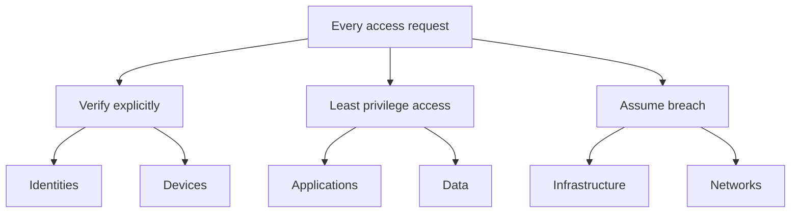
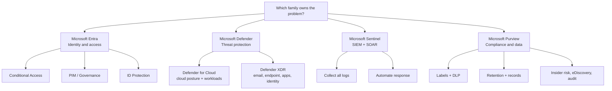
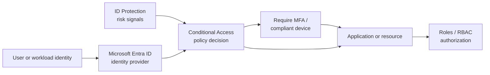
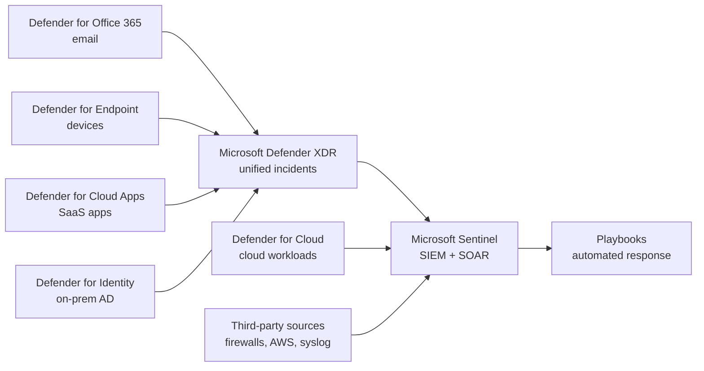

# SC-900 Core Diagrams

This page gives a simple visual overview of the Zero Trust model, the Microsoft security portfolio, and the identity flow.

Use these diagrams as memory anchors before practice tests. SC-900 rarely asks you to draw architecture, but it constantly asks which product family owns a problem and what order things happen in.

## Zero Trust model



Key idea: no request is trusted because of its network location. Every request is authenticated, authorized, and scoped to least privilege, and the environment is designed as if a breach has already happened.

Exam memory hook:

```text
3 principles = verify explicitly, least privilege, assume breach
6 pillars    = identities, devices, applications, data, infrastructure, networks
```

## Microsoft security portfolio map



Exam memory hook:

```text
Entra    = who gets in
Defender = who is attacking
Sentinel = what do all the logs say, and auto-respond
Purview  = how data is classified, protected, kept, and investigated
```

## Identity flow: authentication to access



Order matters on the exam:

1. Authentication: Entra ID verifies the identity (password, passwordless, MFA).
2. Risk evaluation: ID Protection scores user risk and sign-in risk as signals.
3. Policy decision: Conditional Access decides block, grant, or grant with controls.
4. Authorization: roles and RBAC decide what the identity can DO once inside.

Exam memory hook:

```text
AuthN first (prove who), policy next (should we allow), AuthZ last (what can you do)
Detect = ID Protection, Enforce = Conditional Access
```

## Threat signal flow: Defender to Sentinel



Key idea: the four Defender XDR services correlate into unified incidents; Sentinel sits above everything and can ingest Defender XDR, Defender for Cloud, AND third-party sources, then automate response with playbooks.

Exam memory hook:

```text
Email -> Defender for Office 365
Device -> Defender for Endpoint
SaaS app -> Defender for Cloud Apps
On-prem AD -> Defender for Identity
All of it + third party -> Sentinel
```
